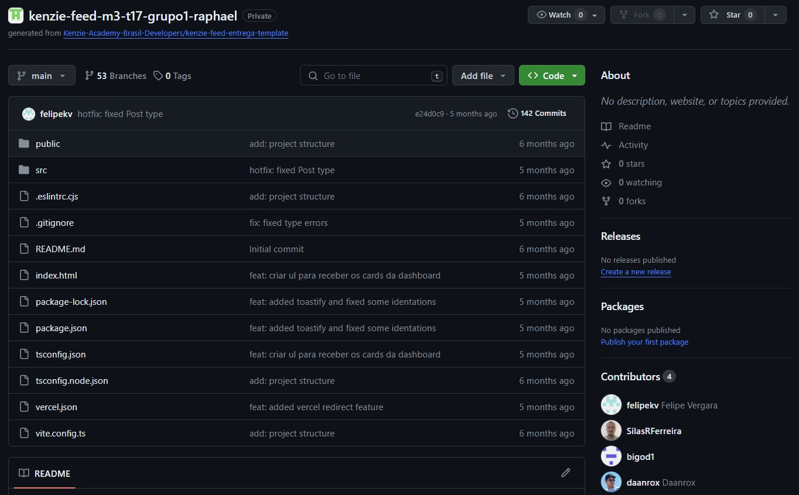

# Kenzie-Feed
Jornal com Funcionalidades de Administração


## Descrição
O Kenzie-Feed é uma aplicação de jornal online com funcionalidades de administrador. Oferece rotas públicas para cadastro, login de usuários e operações CRUD para criar, editar e excluir publicações. O projeto foi desenvolvido em conjunto com outros desenvolvedores alunos da Kenzie Academy.


### Deploy
Aplicação em produção: [https://kenzie-feed-six.vercel.app](https://kenzie-feed-six.vercel.app)

## Tecnologias Utilizadas
- React
- Typescript
- Vite
- React Router

### Repositório original 
[https://github.com/Grupo-1-T17-M3-Raphael/kenzie-feed-m3-t17-grupo1-raphael](https://github.com/Grupo-1-T17-M3-Raphael/kenzie-feed-m3-t17-grupo1-raphael)


## Backend em Produção
O backend está hospedado em [https://kenzie-feed-api.onrender.com/](https://kenzie-feed-api.onrender.com/)

## Funcionalidades
- **Autenticação Segura:** Utilização de JSON Web Token (JWT) para autenticação segura dos usuários.
- **CRUD de Contatos:** Operações completas de criação, leitura, atualização e exclusão de contatos vinculados aos usuários autenticados.
- **Validação de Dados:** Implementação de validação de formulários com React Hook Forms e Zod para garantir a integridade e precisão dos dados.
- **Feedback ao Usuário:** Utilização do pacote Toast para fornecer feedbacks visuais e notificações durante interações com o sistema.
- **Modais Interativos:** Utilização do React Modal para criar modais interativos e facilitar interações específicas do usuário.
- **Carregamento Responsivo:** Implementação do React Loading para indicar efeitos visuais de carregamento durante operações assíncronas.
- **Estilos Personalizados:** Utilização do Styled Components para aplicar estilos dinâmicos e personalizados em toda a aplicação.
- **Requisições HTTP:** Integração do Axios para realizar solicitações HTTP com o backend de forma eficiente e confiável.


## Executando o Projeto

### Pré-requisitos
Certifique-se de ter o Node.js instalado.

### Instalação das Dependências
No terminal, execute o seguinte comando para instalar as dependências:

```bash
npm install
```
### Rodando o Projeto
Para iniciar o projeto, utilize o comando:

```bash
npm run dev
```

Isso iniciará a aplicação Vite em modo de desenvolvimento.

## Contato
Se tiver dúvidas ou precisar de mais informações, sinta-se à vontade para entrar em contato:
- Email : [contato@daanrox.com](mailto:contato@daanrox.com)
- LinkedIn: [https://www.linkedin.com/in/daanrox/](Daanrox)

--- 

Este projeto faz parte do Bootcamp de Desenvolvimento Fullstack na Kenzie Academy.
